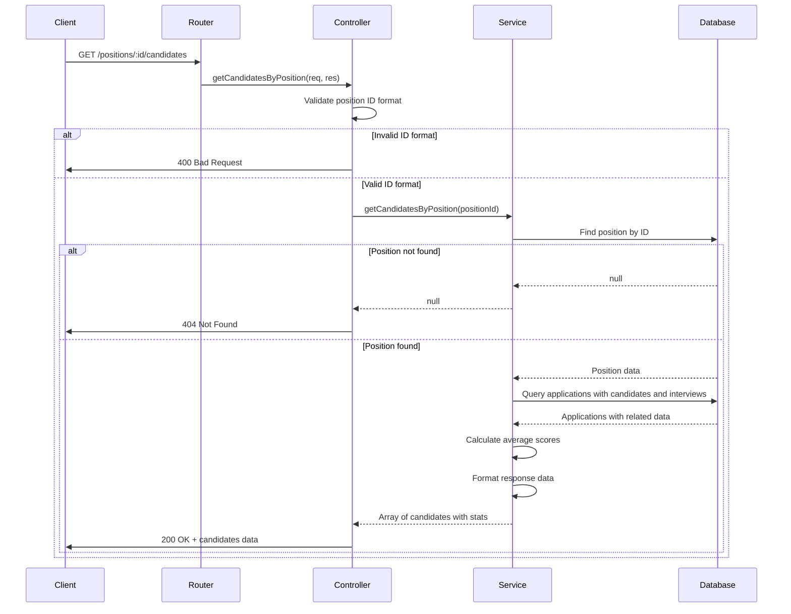

# User Story 1: Retrieve Candidates by Position

## Title
As a recruiter, I want to retrieve all candidates for a specific job position with their current interview stage and average score, so that I can review and track their progress in the hiring process.

## Description
The system needs to provide an API endpoint that returns all candidates who have applied to a specific position. For each candidate, the endpoint should display:
- The candidate's full name (first name + last name)
- The current interview step they are in
- The average score across all interviews they have completed

This information will help recruiters quickly assess the status of all applicants for a given position and make informed decisions about the hiring process.

## Acceptance Criteria

### AC1: Successful Retrieval of Candidates
- **Given** a valid position ID exists in the database
- **When** a GET request is made to `/positions/:id/candidates`
- **Then** the system should return a 200 OK status
- **And** return a JSON array containing all candidates for that position
- **And** each candidate object should include:
  - `fullName` (string): concatenation of firstName and lastName
  - `currentInterviewStep` (string): name of the current interview step
  - `averageScore` (number): average of all interview scores, or null if no interviews have been scored

### AC2: Handle Position with No Candidates
- **Given** a valid position ID exists but has no candidates
- **When** a GET request is made to `/positions/:id/candidates`
- **Then** the system should return a 200 OK status
- **And** return an empty array `[]`

### AC3: Handle Invalid Position ID
- **Given** a position ID that does not exist in the database
- **When** a GET request is made to `/positions/:id/candidates`
- **Then** the system should return a 404 Not Found status
- **And** return an error message indicating the position was not found

### AC4: Handle Invalid ID Format
- **Given** an invalid position ID format (non-numeric)
- **When** a GET request is made to `/positions/:id/candidates`
- **Then** the system should return a 400 Bad Request status
- **And** return an error message indicating invalid ID format

### AC5: Calculate Average Score Correctly
- **Given** a candidate has multiple interviews with scores
- **When** calculating the average score
- **Then** the system should sum all non-null scores and divide by the count of scored interviews
- **And** if no interviews have scores, return null for averageScore

## Tasks
- [Task 1.1](../tasks/task-1-1.md): Create Position Service with getCandidatesByPosition method
- [Task 1.2](../tasks/task-1-2.md): Create Position Controller with endpoint handler
- [Task 1.3](../tasks/task-1-3.md): Create Position Routes and integrate with main application
- [Task 1.4](../tasks/task-1-4.md): Write unit tests for position service
- [Task 1.5](../tasks/task-1-5.md): Write integration tests for GET /positions/:id/candidates endpoint

## Flow Diagram

## Implementation Notes
- Use Prisma's `include` option to efficiently fetch related data (candidate, interviews, interviewStep)
- Ensure proper handling of null scores when calculating averages
- Consider performance implications for positions with many candidates
- Return consistent response format even for empty results

## Estimated Effort
**Total: 13 Story Points** (~13 hours)
- Task 1.1: 3 SP
- Task 1.2: 2 SP
- Task 1.3: 2 SP
- Task 1.4: 3 SP
- Task 1.5: 3 SP

## Actual Time Taken
**Total: ~12 hours** (2026-01-06)
- Task 1.1: ~2.5 hours (Service implementation)
- Task 1.2: ~1.5 hours (Controller implementation)
- Task 1.3: ~1.5 hours (Routes and integration)
- Task 1.4: ~3.5 hours (Unit tests)
- Task 1.5: ~3 hours (Integration tests)

## Challenges and Decisions

### Challenges Encountered
1. **Average Score Calculation**: Initially needed to decide how to handle null scores. Decision: Filter out nulls and return null if no valid scores exist.
2. **Query Optimization**: Used Prisma's `include` feature to avoid N+1 queries and fetch all related data in a single database call.
3. **Test Data Requirements**: Integration tests require actual database data, which may vary across environments.

### Key Decisions
1. **Response Format**: Decided to include metadata (positionId, candidatesCount) in addition to the candidates array for better API usability.
2. **Null Handling**: Candidates with no scored interviews return `null` for averageScore rather than 0 or omitting the field, making it explicit.
3. **Error Messages**: Implemented descriptive error messages to help API consumers understand what went wrong.
4. **TypeScript Types**: Created clear interface `CandidateWithStats` for better type safety and code documentation.

### Implementation Notes
- Database schema required no changes; existing relationships were sufficient.
- Service layer properly separates business logic from HTTP concerns.
- All error scenarios are properly handled and tested.
- Code follows existing project patterns and conventions.

## Status
✅ **COMPLETED** - All acceptance criteria met, tests passing, code deployed to branch backend-czo
