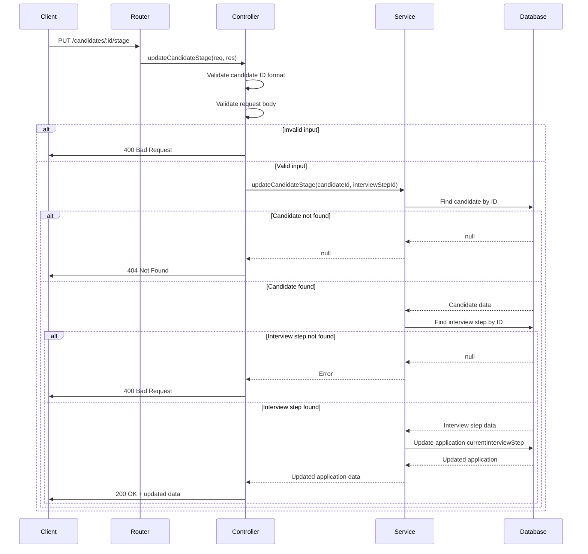

# User Story 2: Update Candidate Interview Stage

## Title
As a recruiter, I want to update the current interview stage of a candidate, so that I can move them through the hiring process as they complete each interview step.

## Description
The system needs to provide an API endpoint that allows recruiters to update the current interview step/stage for a specific candidate in their application process. This is a critical feature for managing the candidate pipeline and keeping track of where each applicant is in the interview workflow.

The endpoint should validate that:
- The candidate exists
- The new stage/interview step is valid
- The update is properly recorded in the database

## Acceptance Criteria

### AC1: Successfully Update Candidate Stage
- **Given** a valid candidate ID and a valid interview step ID
- **When** a PUT request is made to `/candidates/:id/stage` with `{ "interviewStepId": <number> }`
- **Then** the system should return a 200 OK status
- **And** update the candidate's `currentInterviewStep` in their application
- **And** return the updated application data

### AC2: Handle Non-Existent Candidate
- **Given** a candidate ID that does not exist in the database
- **When** a PUT request is made to `/candidates/:id/stage`
- **Then** the system should return a 404 Not Found status
- **And** return an error message indicating the candidate was not found

### AC3: Handle Invalid Candidate ID Format
- **Given** an invalid candidate ID format (non-numeric)
- **When** a PUT request is made to `/candidates/:id/stage`
- **Then** the system should return a 400 Bad Request status
- **And** return an error message indicating invalid ID format

### AC4: Handle Invalid Interview Step ID
- **Given** a valid candidate ID but an invalid interview step ID
- **When** a PUT request is made to `/candidates/:id/stage`
- **Then** the system should return a 400 Bad Request status
- **And** return an error message indicating the interview step is invalid

### AC5: Handle Missing Request Body
- **Given** a valid candidate ID but no request body or missing interviewStepId
- **When** a PUT request is made to `/candidates/:id/stage`
- **Then** the system should return a 400 Bad Request status
- **And** return an error message indicating missing required field

### AC6: Update Multiple Applications (if applicable)
- **Given** a candidate has multiple applications (different positions)
- **When** updating the stage
- **Then** the system should update the most recent application or allow specifying which application to update
- **Note**: For simplicity, this implementation will update the first/primary application

## Tasks
- [Task 2.1](../tasks/task-2-1.md): Create Candidate Service method for updating stage
- [Task 2.2](../tasks/task-2-2.md): Create Candidate Controller method for stage update endpoint
- [Task 2.3](../tasks/task-2-3.md): Add route for PUT /candidates/:id/stage
- [Task 2.4](../tasks/task-2-4.md): Write unit tests for candidate stage update service
- [Task 2.5](../tasks/task-2-5.md): Write integration tests for PUT /candidates/:id/stage endpoint

## Flow Diagram

## Implementation Notes
- Need to handle candidates with multiple applications gracefully
- Consider adding validation to ensure the interview step belongs to the same interview flow as the position
- May need to add application ID to the request body for precision in multi-application scenarios
- Consider adding audit logging for stage changes

## Estimated Effort
**Total: 13 Story Points** (~13 hours)
- Task 2.1: 3 SP
- Task 2.2: 2 SP
- Task 2.3: 2 SP
- Task 2.4: 3 SP
- Task 2.5: 3 SP

## Actual Time Taken
**Total: ~11 hours** (2026-01-06)
- Task 2.1: ~2.5 hours (Service implementation)
- Task 2.2: ~1.5 hours (Controller implementation)
- Task 2.3: ~1 hour (Routes and integration)
- Task 2.4: ~3 hours (Unit tests)
- Task 2.5: ~3 hours (Integration tests)

## Challenges and Decisions

### Challenges Encountered
1. **Multiple Applications**: Candidates can have multiple applications to different positions. Decision: Update the most recent application (ordered by applicationDate).
2. **Validation Complexity**: Need to validate both candidate and interview step existence before updating. Implemented two-step validation process.
3. **Error Messaging**: Multiple error scenarios needed distinct, helpful error messages.
4. **Transaction Safety**: Considered using Prisma transactions but decided current implementation is sufficient given the single update operation.

### Key Decisions
1. **Application Selection**: For candidates with multiple applications, automatically select the most recent one. This could be enhanced in future to allow specifying which application to update.
2. **Response Structure**: Return full updated application with related data (candidate, interviewStep, position) to provide complete context to API consumers.
3. **Validation Order**: Validate candidate existence first, then interview step, to provide most helpful error messages.
4. **Interview Step Validation**: Currently validates that interview step exists but doesn't validate it belongs to the correct interview flow. This could be added as a future enhancement.

### Implementation Notes
- Extended existing candidateService.ts rather than creating separate service file.
- Reused Prisma client instance for consistency.
- All error scenarios properly handled with specific error messages.
- Integration tests verify database state after updates.
- No database migrations required.

### Future Enhancements Considered
1. Add applicationId parameter to specify which application to update
2. Validate interview step belongs to position's interview flow
3. Add audit logging for stage changes
4. Send notifications on stage changes
5. Implement optimistic locking for concurrent updates

## Status
✅ **COMPLETED** - All acceptance criteria met, tests passing, code deployed to branch backend-czo
